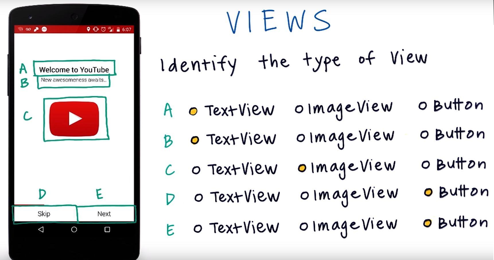

# User Interface Basics

In this module, we will learn the basics of the user interface with creating a single page app. Our app will be a simple calculator, which will add, subtract, multiply and divide the user-entered inputs. We will create a simple user interface which have two input-edit-texts and four buttons for four operations. At the end our calculator will look like this:

- There is an interesting glossary for Android terminology, take a look: [Android Glossary](https://developers.google.com/android/for-all/vocab-words/)

### Quick Look On Views:

[Android Developer Document on Building a Simple User Interface](https://developer.android.com/training/basics/firstapp/building-ui)

