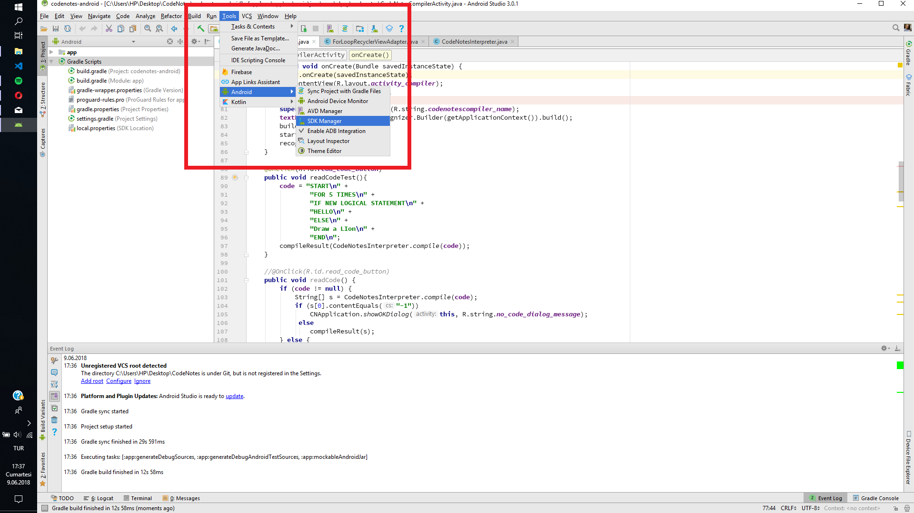

# Installation Guide

1. Download and install the Java Development Kit \(JDK\)



1. Download and install Android Studio.



1. When you have finished the installation of Android Studio, find the SDK Manager.

1. Run the Android SDK Manager to update the Android SDK and install extra packages
2. Create a new virtual device to run your apps on a virual device. You can find the button on the top of the SDK Manager. \(Tools &gt; Android &gt; AVD Manager\)
3. Build your first app to test your development environment. You can follow the guideline:

